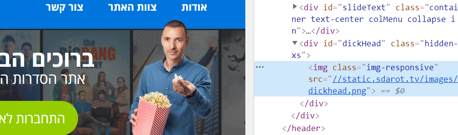
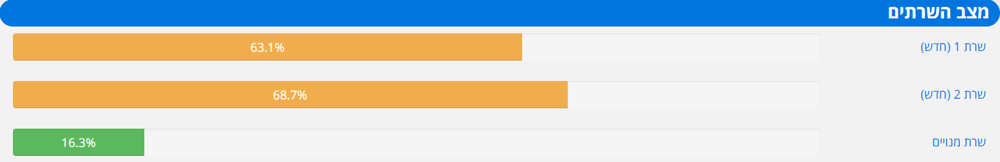

Израиль передовая страна во многих областях и в частности, когда речь заходит о технологиях. В Тель-Авиве давно обосновались подразделения транснациональных
компаний и молодых стартапов. Но наряду с официальными идеями, развиваются и более темные проекты. Сильнее всего это
заметно в сфере пиратства. Там идет самая активная борьба. Нелегальные кинотеатры всегда будут иметь преимущество перед легальными из-за
наличия всего существующего контента. Раньше Netflix могли похвастаться подобным, но позже стали появляться и другие агрегаторы
фильмов, сериалов, шоу. Из-за этого всем пришлось начать снимать эксклюзивы (Netflix originals, HBO original series),
чтобы пользователь не ушел к более дешевому конкуренту с такой же библиотекой. В итоге мы вернулись к начальному состоянию... Только вместо
телевизионных каналов у нас теперь стриминговые сервисы.

В начале 10-ых в Израиле было много пиратских кинотеатров, но до 2021 года смог дожить только один — sdarot. Сейчас он является единственным
сайтом, где можно бесплатно (без смс, регистрации и рекламы) посмотреть сериалы на иврите. Даже те, которые давно были удалены
из легальных сервисов (оказывается хиты 2010 года это уже старье). Конечно, так хорошо все не могло долго продолжаться, поэтому в апреле 2011 года появились они, главные борцы
в ~~ру~~изранете — ZIRA (авторские права в сети интернет). В нее вошли все крупные телеканалы, кинотеатры и студии страны. Один за другим
начали закрываться пиратские сайты, но sdarot всегда удавалось избежать подобного.

Порой дело ограничивалось блокировкой домена, что быстро решалось сменой последнего. Создатели крупнейшего пиратского
ресурса даже начали подшучивать над организацией. Некоторое время sdarot был доступен по адресу
zira.ninja и zira.online. Подобным образом поступил и другой старый нелегальный сайт — horadot.net (уже не работает). После основной блокировки
они вернулись, но уже в формате особого поисковика. Таким образом horadot.net обходили закон, так как они не хранили серии, защищенные
авторским правом, на своих серверах. После ввода названия, пользователю показывались прямые ссылки на сторонние несвязанные ресурсы.
Сам поисковый движок работал по адресу izira.info с довольно вызывающим логотипом.

Также не остались без внимания главные представители ZIRA. Около шапки sdarot можно увидеть их адвоката — Эрана Парезанти, держащим попкорн (отсылка
к популярному BitTorrent-клиенту Popcorn Time, против которого также судились ZIRA). Вдобавок, если заглянуть в код сайта, то можно узнать,
что эта картинка хранится под название dickhead.png.

Чуть ниже находиться глава организации — Моти Амити. Его фамилия дословно переводится, как "настоящий". Поэтому неудивительно, что
он выступает за все оригинальное. Его лицо стоит на рекламном баннере рядом с фейковой цитатой:

> Я тоже подписан на телеграм канал Sdarot_HumanRights.

На некоторых страницах можно увидеть это же изображение, но уже с лицом специалистки ZIRA — Лираз Зельменсон.

Также раньше существовал и другой канал — zira\_ganavim (zira\_воры), но сейчас он уже не работает. На момент
написания статьи, на телеграм sdarot было подписано 3629 подписчиков, а на инстаграм — 12500. В теперь уже удаленной группе в фейсбуке числилось
77000 участников. Но при этом сам сайт посещают в месяц 3 миллиона пользователей. Напоминаю, что население Израиля равно 9.2
миллиона человек. Это целая одна треть от всех жителей!

На сайте доступна платная подписка за 35 шекелей (оплата криптоволютой доступна), которая позволяет смотреть видео в наилучшем качестве без 30 секундного
ожидания в начале. Вдобавок появляется кнопка для скачивания серии. Для премиумов контент отдается с недоступного обычным пользователям сервера, поэтому
даже при большой посещаемости у них не возникнут проблемы. Загруженность каждого можно увидеть на отдельной странице. Последний прогресс бар
отображает выделенный для платных пользователей сервер.

Серьезных проблем с доступом действительно не было за последние несколько лет. За исключением одной даты — 10 марта 2021.
Тогда облачный провайдер OVH сообщил, что ночью в дата-центре SBG2 произошел крупный пожар. Потушить его удалось только к раннему утру.
Вместе со множеством сайтов упал и sdarot, который не мог ожидать подобного у крупнейшего хостинг-провайдера в Европе. Пиратскому кинотеатру
потребовалась неделя, чтобы заново запуститься. К счастью многих пользователей, библиотека сериалов и личные данные не пострадали.

Сейчас сайт работает стабильно. В социальных сетях проводят розыгрыши подписок. Иногда администратор бесплатно их выдает
тяжелобольным и малоимущим. Но видеть в нем альтруиста и идеалиста не совсем правильно из-за резких высказываний в твиттере и непонятных
сообщений на главной странице. В блоке уведомлений вместе с пожеланиями здоровья солдатам и рассказами о новых фичах, мелькают порой и
неоднозначные посты:

- просьба скинуть паспорт гражданина Российской Федерации в обмен на подписку
- поддержка различных представителей кнессета
- призывы к действию (например, объявление бойкота производителю мороженного Ben & Jerry’s после антисемитских высказываний)